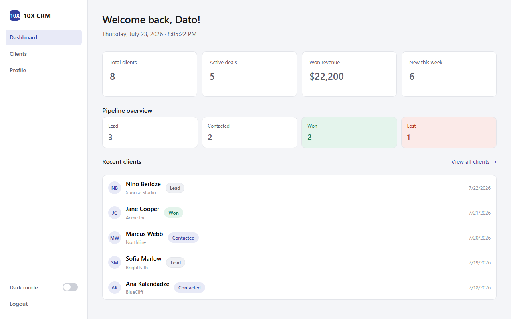
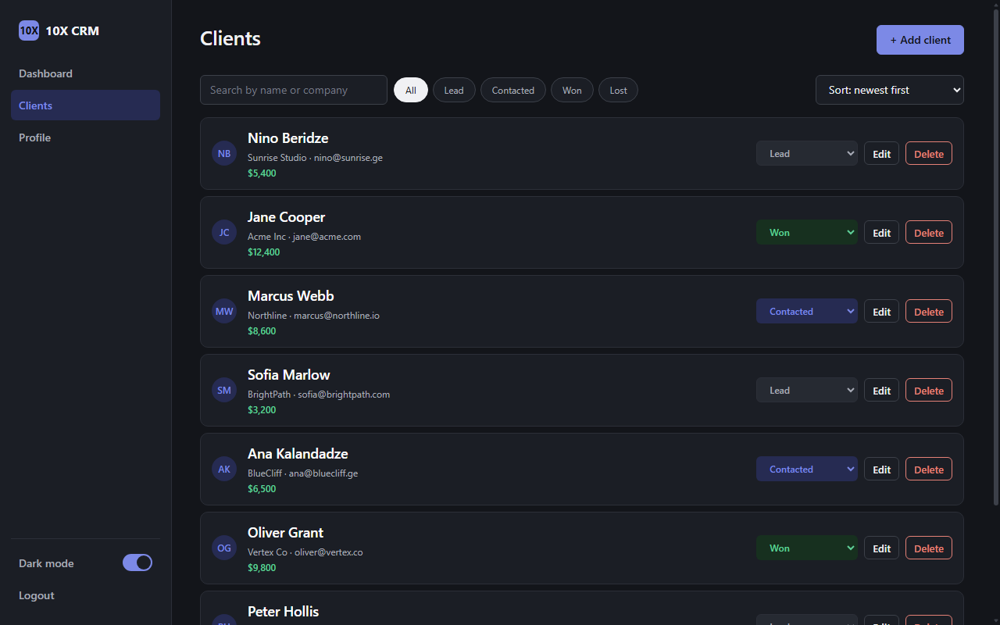

# 10X CRM

A lightweight client relationship management tool for sales managers.
It replaces a messy spreadsheet with one place to track leads, deals in
progress, notes, and follow-up reminders. Built with vanilla JavaScript,
HTML and CSS — no frameworks, no build step, no dependencies.

**Live demo:** https://10x-crm-dato-chaduneli.vercel.app/

| Dashboard (light theme) | Clients (dark theme) |
|---|---|
|  |  |

## Features

- Email/password sign up and login with field-level validation that
  clears live as you type
- Auth guard on every page: dashboard/clients/profile require a
  session, logged-in users are redirected past login/signup
- Dashboard: live clock, four key stats, pipeline overview, five most
  recent clients
- Clients loaded from the DummyJSON API (GET) and cached in
  `localStorage`; add (POST), edit (PUT), delete (DELETE), plus inline
  status change right on the card
- Debounced search, status filter chips and three sort orders — all
  combinable
- Per-client notes and a one-minute follow-up reminder (the button
  shows its pending state)
- Custom avatars by URL for both clients and the user profile, with
  initials as the fallback
- Profile editing, password change, one-click data reset
- Dark / light theme, persisted, applied before first paint (no flash)
- Toasts instead of browser alerts; loading, empty and error states
  with a retry button
- Responsive from desktop to phone; keyboard-friendly: Esc closes
  modals, Enter adds a note, filter chips are real buttons

## Tech stack

- Vanilla JavaScript (ES6+), no frameworks or libraries
- HTML5 + CSS3 (custom properties for design tokens and theming)
- [DummyJSON](https://dummyjson.com) as a mock REST API
- Browser `localStorage` as the persistence layer
- Deployed on Vercel (static site, no backend)

## Project structure

```
├── index.html        # Log in (public)
├── signup.html       # Sign up (public)
├── dashboard.html    # Stats, pipeline, recent clients
├── clients.html      # Client list, add/edit modal, detail modal
├── profile.html      # Profile, password change, data reset
├── css/style.css     # Design tokens, themes, components, breakpoints
└── js/
    ├── data.js       # localStorage layer, API load, shared helpers
    ├── guard.js      # Auth guard + nav/theme/logout wiring
    ├── auth.js       # Sign-up and login forms
    ├── dashboard.js  # Dashboard rendering
    ├── clients.js    # CRUD, search/filter/sort, notes, reminders
    └── profile.js    # Profile forms
```

## How to run

1. Clone this repository.
2. Open `index.html` directly in a browser, or serve the folder with
   any static file server, for example:
   ```
   npx serve .
   ```
3. Sign up for a new account, then log in. The first visit fetches 30
   sample clients from DummyJSON; everything after that runs from
   `localStorage`.

No build step, no dependencies to install. There is no seed account —
all data lives in your own browser, so just register.

## Known limitations

- DummyJSON is a mock API: POST/PUT/DELETE requests get realistic
  responses, but nothing is persisted server-side. The app treats
  `localStorage` as the source of truth by design.
- Data is per-browser and per-device — there is no backend or sync.
- Passwords are stored in plain text in `localStorage`. Acceptable for
  a learning project with fake data; never for production.

## Credits

Built as an individual project. AI tools (Claude) were used during
development — see [`ai-log.md`](ai-log.md) for the detailed usage log.
